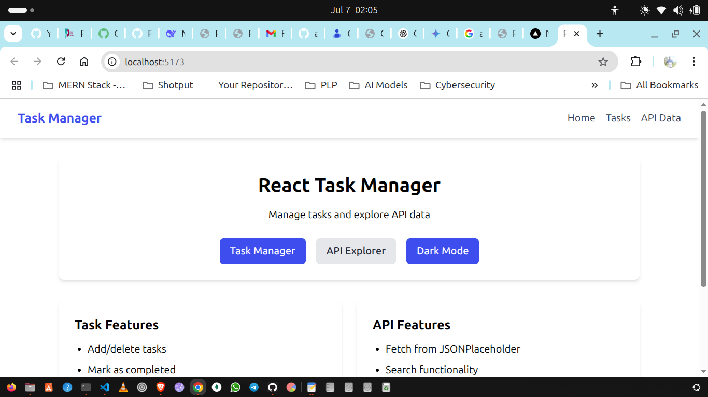
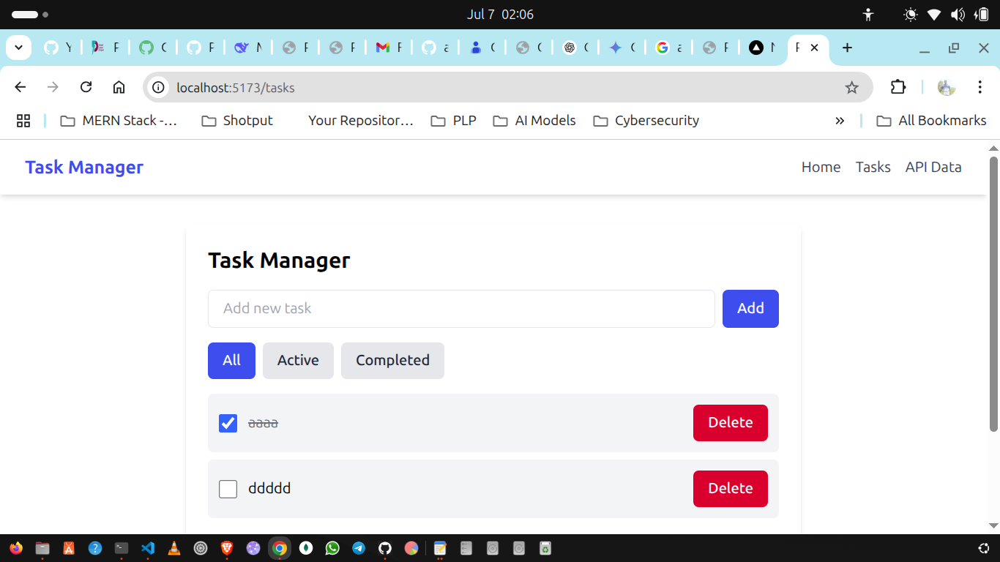
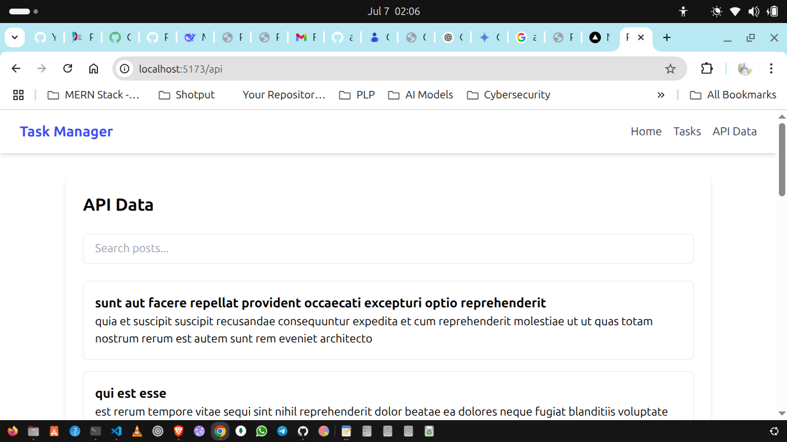

# React Task Manager

## Features
- Task management with local storage
- API data fetching with search
- Dark/light mode toggle
- Responsive design

## Setup
1. Clone repository: \`git clone <repo-url>\`
2. Install dependencies: \`npm install\`
3. Start dev server: \`npm run dev\`

## Screenshots

## Live Demo
[View on Vercel](https://your-deployed-url.vercel.app)
\n## Live Demo\n[View on Vercel](https://week-3-react-js-assignment-one-willy-qees6al8j.vercel.app)

## Live Demo
[View on Vercel](https://week-3-react-js-assignment-one-willy-qees6al8j.vercel.app)

## Screenshots

